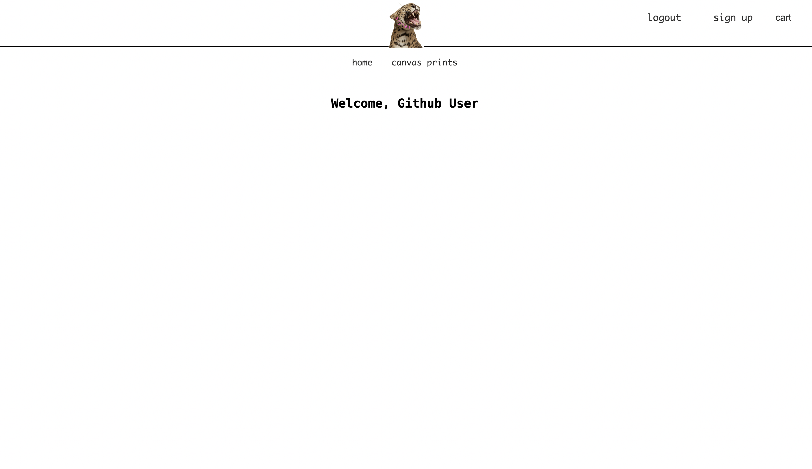
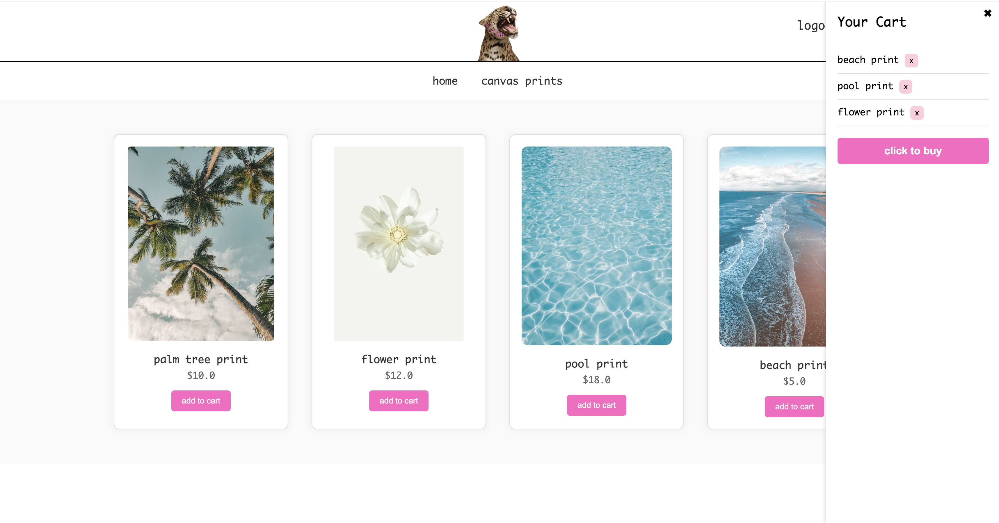
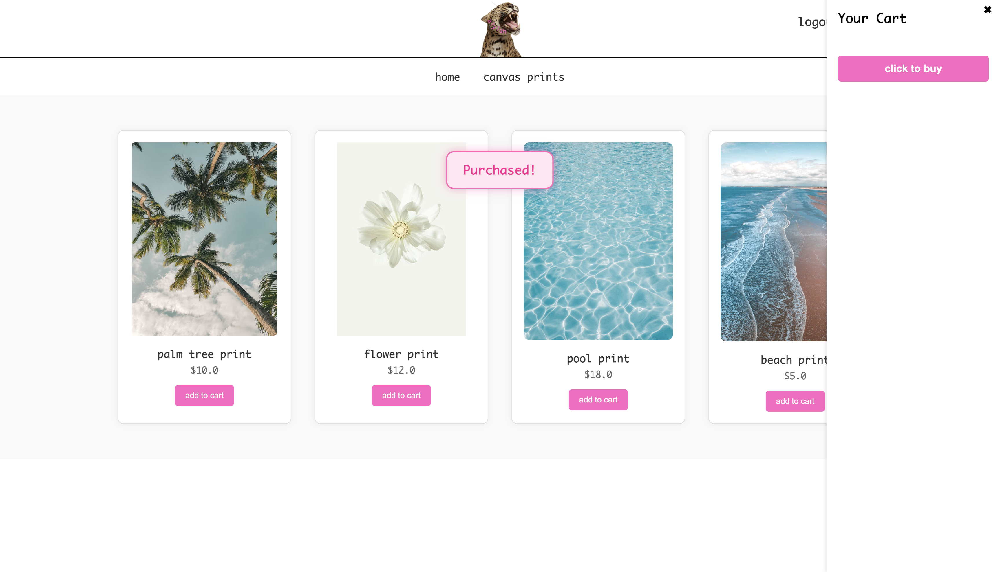
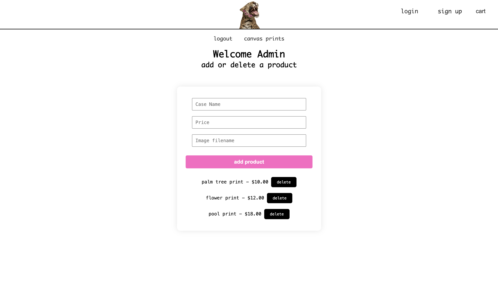

# Flask E-Commerce App

A fully functional e-commerce web application built with Flask, featuring user login, product browsing, admin dashboard, and cart functionality.

## Live Demo

Hosted on [Render](https://flask-e-commerce-app.onrender.com/)  

## Demo Video
[Watch the video here](Flask-Store-Demo.mov)

## Features

- Secure user authentication (sign up, login)
- Add-to-cart and checkout system
- Admin dashboard to manage products (add, remove)
- SQLite3 database integration
- Responsive front-end layout
- Image upload/display for products

## 🗒️ Note
The initial delay (after the first 'click to buy' action) is due to Render cold start and database session initialization. This only occurs once per user session.

## 📸 Screenshots

### User View

### Admin View

## Tech Stack

- **Python** (Flask)
- **HTML/CSS/JavaScript**
- **SQLite3**
- **Jinja2**
- **Gunicorn** (for production)

## Admin Login details available upon request.
